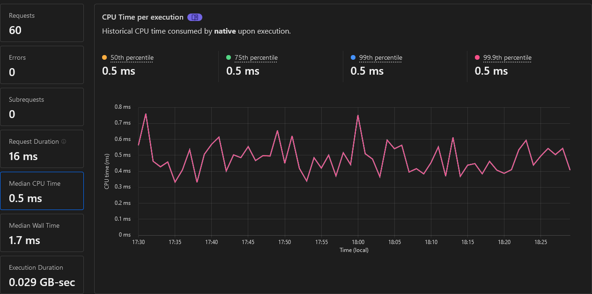
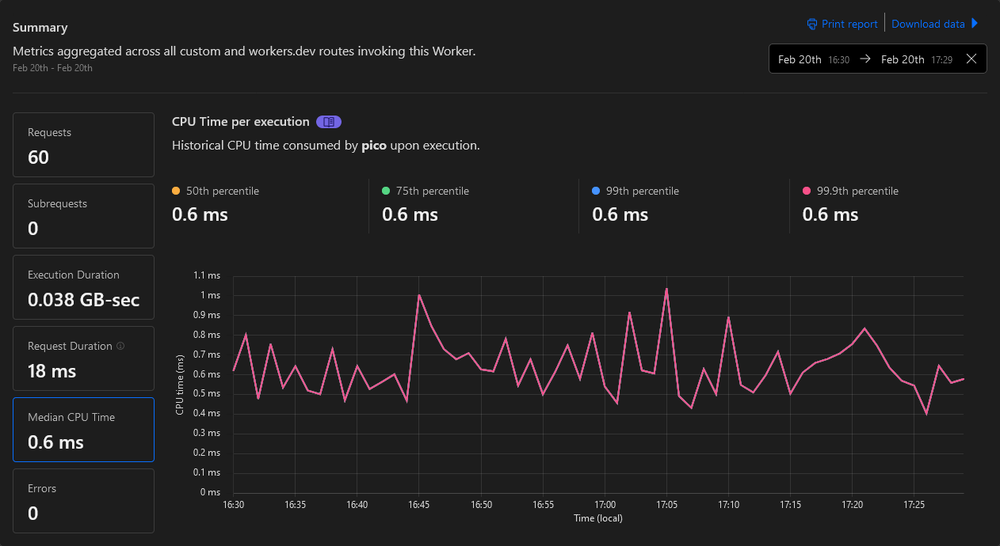
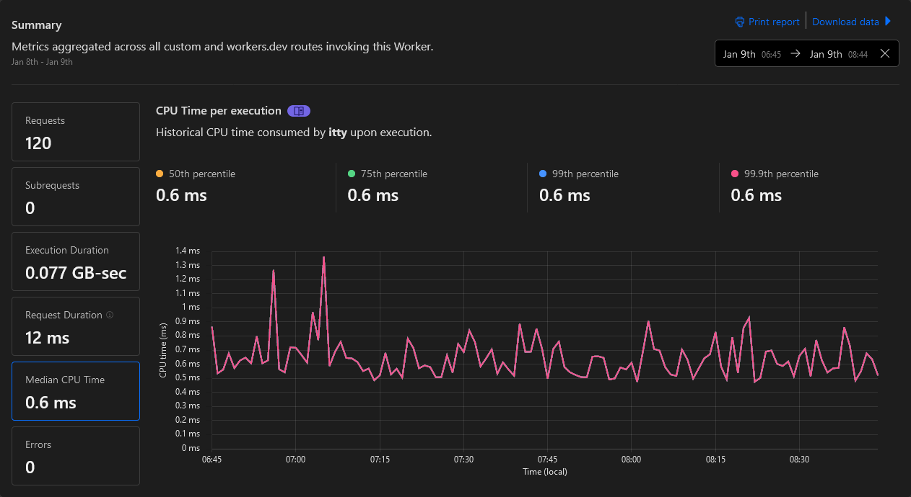
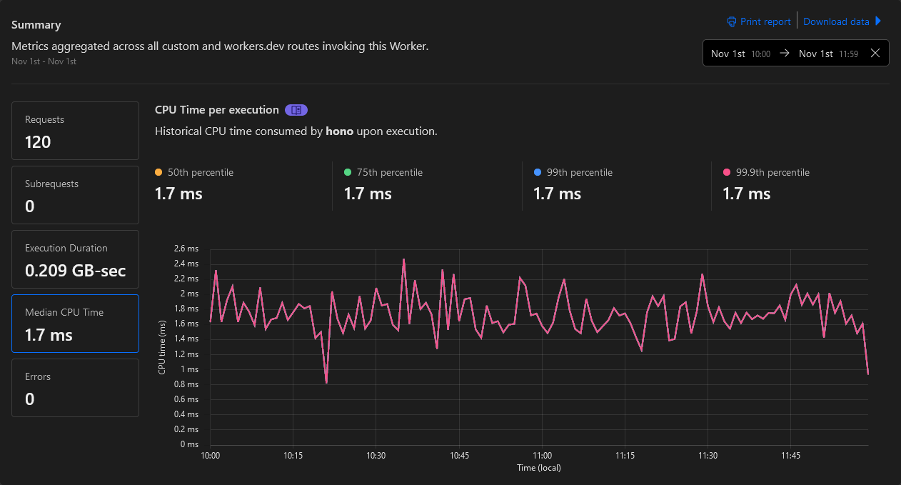
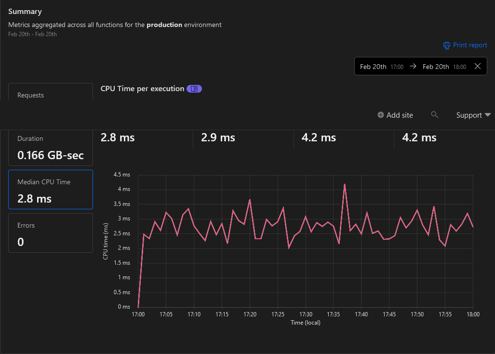
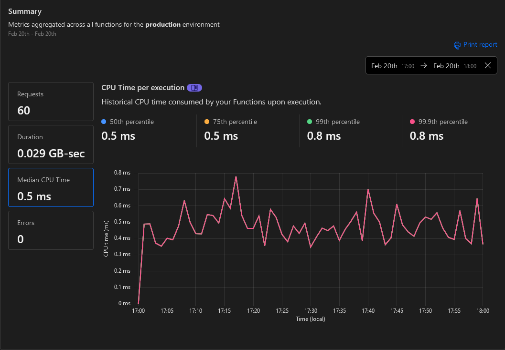
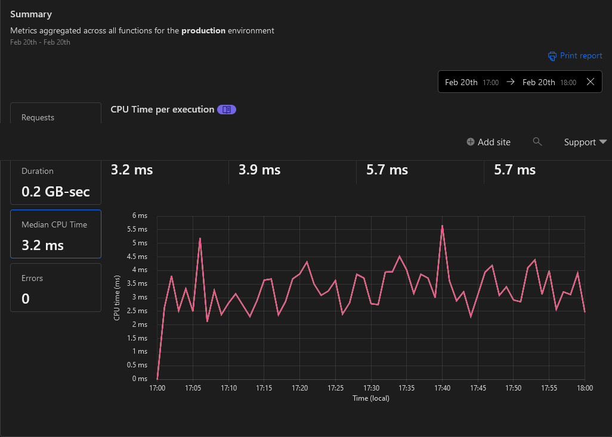

# cloudflare-playground

Metric studies on Cloudflare Workers & Pages

## CHANGELOG

- v0.9.0 2024-03-28

  - wrangler 3.39.0 & @cloudflare/workers-types 4.20240320.1
  - itty-router 4.2.2
  - hono 4.1.4

- v0.8.0 2024-02-20

  - wrangler 3.28.3 & @cloudflare/workers-types 4.20240208.0
  - itty-router 4.0.27
  - hono 4.0.4
  - @picojs/pico 0.3.2

- v0.7.0 2024-01-09

  - wrangler & @cloudflare/workers-types moved to central/main package
  - itty-router 4.0.26
  - hono 3.12.0

- v0.6.0 2023-11-01

  - New "Standard usage model" + CPU limit
  - Minify on deploy
  - wrangler 3.15.0

## Workers

- Native (Total Upload: 0.36 KiB / gzip: 0.26 KiB ~~0.53 KiB / gzip: 0.32 KiB~~) \
  _No routing and no helper, but fastest_
  

- [Pico](https://github.com/yusukebe/pico) v0.3.2 (Total Upload: 0.65 KiB / gzip: 0.45 KiB ~~0.97 KiB / gzip: 0.55 KiB~~) \
  _Light router but no helpers, fast anyway_
  

- [itty-router](https://github.com/kwhitley/itty-router) v4.0.27 (Total Upload: 1.47 KiB / gzip: 0.91 KiB ~~2.10 KiB / gzip: 1.08 KiB~~) \
  _Famous router with its helpers, fast_
  

- [Hono/tiny](https://github.com/honojs/hono) v4.0.4 (Total Upload: 12.84 KiB / gzip: 4.74 KiB ~~28.33 KiB / gzip: 7.18 KiB~~) \
  _Real fast router but slightly too heavy for a 'free plan' 10ms_
  

## Pages & Functions

- Native
  

- Native/Advanced
  

- [itty-router](https://github.com/kwhitley/itty-router)
  
