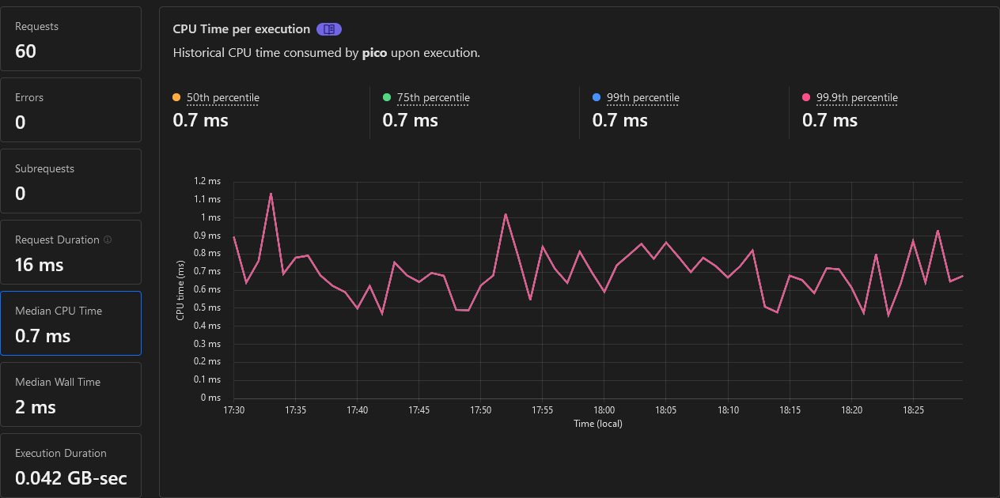

# cloudflare-playground

Metric studies on Cloudflare Workers & Pages

## CHANGELOG

- v0.6.0 2023-11-01
  - New "Standard usage model" + CPU limit
  - Minify on deploy
  - wrangler 3.15.0

## Workers

- Native (Total Upload: 0.36 KiB / gzip: 0.26 KiB ~~0.53 KiB / gzip: 0.32 KiB~~) \
  _No routing and no helper, but fastest_
  

- [Pico](https://github.com/yusukebe/pico) v0.3.1 (Total Upload: 0.63 KiB / gzip: 0.42 KiB ~~0.97 KiB / gzip: 0.55 KiB~~) \
  _Light router but no helpers, fast anyway_
  

- [itty-router](https://github.com/kwhitley/itty-router) v4.0.23 (Total Upload: 1.46 KiB / gzip: 0.89 KiB ~~2.10 KiB / gzip: 1.08 KiB~~) \
  _Famous router with its helpers, fast_
  

- [Hono/tiny](https://github.com/honojs/hono) v3.9.1 (Total Upload: 13.52 KiB / gzip: 5.14 KiB ~~28.33 KiB / gzip: 7.18 KiB~~) \
  _Real fast router but slightly too heavy for a 'free plan' 10ms_
  

<!-- ## Pages & Functions

- Native 

- [Pico](https://github.com/yusukebe/pico)
  

- [itty-router](https://github.com/kwhitley/itty-router)
  

- [Hono/quick](https://github.com/honojs/hono)
   -->
