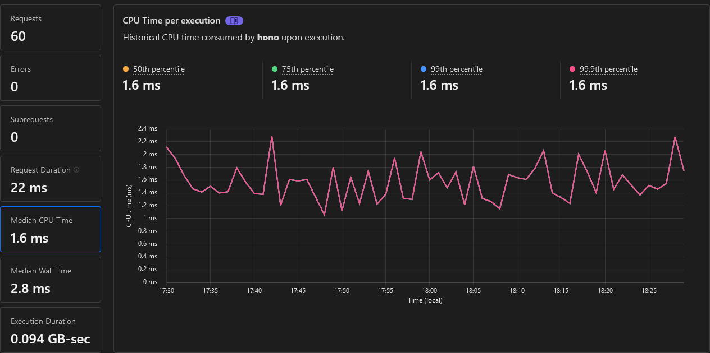

# cloudflare-playground

Metric studies on Cloudflare Workers & Pages

## Workers

- Native (Total Upload: 0.51 KiB / gzip: 0.32 KiB) \
  _No routing and no helper, but fastest_
  

- [Pico](https://github.com/yusukebe/pico) (Total Upload: 0.96 KiB / gzip: 0.55 KiB) \
  _Light router but no helpers, fast anyway_
  
  
- [itty-router](https://github.com/kwhitley/itty-router) (Total Upload: 2.08 KiB / gzip: 1.09 KiB) \
  _Famous router with its helpers, fast_
  

- [Hono/quick](https://github.com/honojs/hono) (Total Upload: 28.10 KiB / gzip: 6.86 KiB) \
  _Real fast router but slightly too heavy for a 'free plan' 10ms_
  

## Pages & Functions

- Native 

- [Pico](https://github.com/yusukebe/pico)
  

- [itty-router](https://github.com/kwhitley/itty-router)
  

- [Hono/quick](https://github.com/honojs/hono)
  
